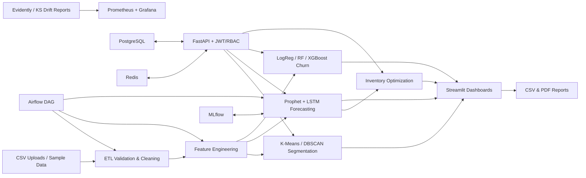

# RetailPulse

RetailPulse is an AI-powered customer analytics and demand forecasting platform for retail teams. It combines sales analytics, 30-day demand forecasting, customer segmentation, churn prediction, inventory optimization, drift monitoring, and exportable reports in a Streamlit web application with a FastAPI service layer.

## Architecture Diagram



## Project Overview

Core capabilities:

- Ingest `sales.csv`, `customers.csv`, `inventory.csv`, and `transactions.csv`
- Validate schemas, clean missing values, remove duplicates, and cap outliers
- Build RFM, lag, rolling mean, moving average, date, and holiday features
- Segment customers into VIP, Loyal, New, Regular, At-Risk, and Lost groups
- Forecast demand for the next 30 days with Prophet, LSTM, and an ensemble
- Predict churn probability, risk score, and reason codes
- Generate reorder quantity, safety stock, reorder point, EOQ, low-stock alerts, and overstock alerts
- Export CSV and PDF reports
- Serve authenticated API endpoints with Swagger docs
- Track experiments through MLflow and monitor drift through Evidently-compatible HTML reports
- Deploy with Docker Compose or Kubernetes

## Repository Structure

```text
RetailPulse/
├── app.py
├── pages/
├── src/
│   ├── api/
│   ├── churn/
│   ├── database/
│   ├── drift/
│   ├── etl/
│   ├── forecasting/
│   ├── inventory/
│   ├── monitoring/
│   ├── segmentation/
│   └── utils/
├── airflow/dags/
├── data/sample/
├── k8s/
├── mlflow/
├── monitoring/
├── notebooks/
├── tests/
└── .github/workflows/
```

## Installation

```bash
cd RetailPulse
python3.11 -m venv .venv
source .venv/bin/activate
pip install --upgrade pip
pip install -r requirements.txt
python -m src.utils.sample_data
```

For a lighter local development environment, install the common runtime first:

```bash
pip install pandas numpy scikit-learn scipy plotly streamlit fastapi uvicorn python-dotenv reportlab pytest prometheus-client sqlalchemy
```

The code uses graceful fallbacks when optional heavyweight packages are unavailable.

## Usage

Run the Streamlit app:

```bash
streamlit run app.py
```

Run the API:

```bash
uvicorn src.api.main:app --reload
```

Open API documentation at:

- Swagger UI: `http://localhost:8000/docs`
- Health check: `http://localhost:8000/health`

Demo API users:

- `admin` / `admin123`
- `analyst` / `analyst123`

## API Documentation

Authenticated endpoints use a bearer token from `/token`.

```bash
curl -X POST http://localhost:8000/token \
  -H "Content-Type: application/x-www-form-urlencoded" \
  -d "username=analyst&password=analyst123"
```

Endpoints:

- `POST /forecast` with `{"product_id": "P001", "periods": 30}`
- `GET /churn`
- `GET /segments`
- `GET /inventory`
- `GET /health`
- `POST /upload/{dataset_name}`

## Docker Deployment

```bash
docker compose up --build
```

Services launched:

- Streamlit: `http://localhost:8501`
- FastAPI: `http://localhost:8000`
- PostgreSQL: `localhost:5432`
- Redis: `localhost:6379`
- MLflow: `http://localhost:5000`
- Prometheus: `http://localhost:9090`
- Grafana: `http://localhost:3000`

## Kubernetes Deployment

```bash
kubectl apply -f k8s/configmap.yaml
kubectl apply -f k8s/secrets.yaml
kubectl apply -f k8s/deployment.yaml
kubectl apply -f k8s/service.yaml
kubectl apply -f k8s/ingress.yaml
kubectl apply -f k8s/autoscaling.yaml
```

Replace `k8s/secrets.yaml` values with your cluster secret manager before production use.

## MLOps

- `airflow/dags/retailpulse_pipeline.py` orchestrates ingestion, feature engineering, model training, evaluation, registration, deployment, and drift monitoring.
- `src/utils/mlflow_utils.py` tracks parameters, metrics, and model artifacts.
- `src/drift/drift_detector.py` creates Evidently reports when Evidently is installed and falls back to statistical KS drift reports.
- `src/monitoring/metrics.py` exposes Prometheus counters, histograms, and gauges.

## Testing

```bash
pytest -q
ruff check .
python scripts/train_smoke.py
```

## Screenshots
 


## Future Improvements

- Add managed feature store integration
- Persist trained model artifacts in S3
- Add batch scoring and streaming demand signals
- Add tenant-level RBAC and SSO
- Add automated Kubernetes rollout through AWS EKS and GitHub environment approvals
