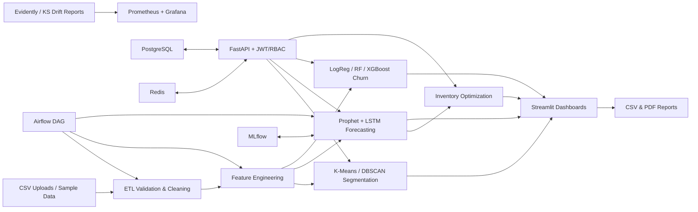

# RetailPulse – AI-Powered Customer Analytics & Demand Forecasting Platform

## Project Overview

RetailPulse is an end-to-end AI-powered analytics platform designed for retail businesses to make data-driven decisions using Machine Learning and Predictive Analytics.

The platform analyzes historical sales data, customer purchase behavior, and inventory records to provide actionable business insights such as demand forecasting, customer segmentation, churn prediction, and inventory optimization.

The primary goal of this project is to help retailers reduce stockouts, improve customer retention, optimize inventory levels, and increase overall profitability through intelligent forecasting and analytics.

---

## Architecture Diagram



## Project Overview

Core capabilities:

- Ingest `sales.csv`, `customers.csv`, `inventory.csv`, and `transactions.csv`
- Validate schemas, clean missing values, remove duplicates, and cap outliers
- Build RFM, lag, rolling mean, moving average, date, and holiday features
- Segment customers into VIP, Loyal, New, Regular, At-Risk, and Lost groups
- Forecast demand for the next 30 days with Prophet, LSTM, and an ensemble
- Predict churn probability, risk score, and reason codes
- Generate reorder quantity, safety stock, reorder point, EOQ, low-stock alerts, and overstock alerts
- Export CSV and PDF reports
- Serve authenticated API endpoints with Swagger docs
- Track experiments through MLflow and monitor drift through Evidently-compatible HTML reports
- Deploy with Docker Compose or Kubernetes
  
## Screenshots
 


## Repository Structure

```text
RetailPulse/
├── app.py
├── pages/
├── src/
│   ├── api/
│   ├── churn/
│   ├── database/
│   ├── drift/
│   ├── etl/
│   ├── forecasting/
│   ├── inventory/
│   ├── monitoring/
│   ├── segmentation/
│   └── utils/
├── airflow/dags/
├── data/sample/
├── k8s/
├── mlflow/
├── monitoring/
├── notebooks/
├── tests/
└── .github/workflows/
```

## Problem Statement

Retail businesses often face challenges such as:

* Running out of stock during high demand periods
* Overstocking products leading to unnecessary storage costs
* Difficulty identifying valuable customers
* Losing customers without knowing the reasons
* Making business decisions based on intuition instead of data

RetailPulse addresses these challenges by transforming raw retail data into actionable insights through machine learning models and interactive dashboards.

---

## Solution Architecture

The platform follows a complete Data Science lifecycle:

### Data Collection

The system ingests data from multiple sources:

* Sales transactions
* Customer information
* Inventory records

### Data Processing

The raw data is cleaned, validated, and transformed using automated ETL pipelines.

Data preparation includes:

* Missing value handling
* Duplicate removal
* Outlier detection
* Feature engineering
* RFM score generation

### Machine Learning Layer

The platform contains multiple machine learning modules:

#### Demand Forecasting

A hybrid forecasting engine was developed using Prophet and LSTM models.

The system predicts product demand for the next 30 days, helping businesses prepare inventory in advance.

#### Customer Segmentation

Customers are grouped into meaningful segments using clustering algorithms such as K-Means and DBSCAN.

Example segments:

* VIP Customers
* Loyal Customers
* Regular Customers
* New Customers
* At-Risk Customers
* Lost Customers

These segments allow businesses to create personalized marketing strategies.

#### Churn Prediction

A supervised machine learning model was built using XGBoost to identify customers who are likely to stop purchasing.

The model generates a churn risk score for each customer, enabling businesses to take proactive retention actions.

#### Inventory Optimization

Demand forecasts are combined with inventory data to generate intelligent reorder recommendations.

The system calculates:

* Reorder Point
* Safety Stock
* Economic Order Quantity

This helps retailers maintain optimal stock levels while reducing both understock and overstock situations.

---

## Dashboard and User Interface

A fully interactive web application was developed using Streamlit.

The dashboard contains multiple modules:

### Executive Dashboard

Displays key business metrics:

* Revenue
* Orders
* Customer Count
* Inventory Status

### Sales Analytics

Provides detailed sales trends and performance analysis.

### Demand Forecasting Dashboard

Visualizes future demand predictions and seasonal patterns.

### Customer Analytics Dashboard

Displays customer segments and purchasing behavior insights.

### Churn Prediction Dashboard

Highlights high-risk customers and churn probabilities.

### Inventory Optimization Dashboard

Provides stock alerts and reorder recommendations.

### Reporting Module

Allows exporting reports in CSV and PDF formats.

---

## MLOps and Production Features

To ensure scalability and production readiness, modern MLOps practices were implemented.

### MLflow

Used for:

* Experiment tracking
* Model versioning
* Performance monitoring

### Evidently AI

Used for:

* Data drift detection
* Feature drift monitoring
* Model health tracking

### Airflow

Used to automate:

* Data ingestion
* Feature engineering
* Model retraining
* Performance evaluation

---

## Deployment and Infrastructure

The application was containerized using Docker and configured for deployment using Kubernetes.

Deployment components include:

* Streamlit Frontend
* FastAPI Backend
* PostgreSQL Database
* Redis Cache
* MLflow Tracking Server

CI/CD pipelines were implemented using GitHub Actions to automate testing and deployment.

---

## Technologies Used

Programming Language:

* Python

Machine Learning:

* Scikit-Learn
* XGBoost
* Prophet
* PyTorch
* SHAP

Data Processing:

* Pandas
* NumPy

Visualization:

* Plotly
* Matplotlib
* Streamlit

Database:

* PostgreSQL
* Redis

MLOps:

* MLflow
* Airflow
* Evidently AI

Deployment:

* Docker
* Kubernetes
* GitHub Actions

---

## Business Impact

The platform enables retail businesses to:

* Forecast future demand accurately
* Reduce stockouts and excess inventory
* Identify high-value customers
* Predict customer churn before it happens
* Improve retention strategies
* Make data-driven inventory decisions

Expected outcomes include:

* Reduced stock shortages
* Better inventory utilization
* Increased customer retention
* Improved operational efficiency
* Higher revenue generation

---

## Key Learnings

Through this project, I gained hands-on experience in:

* Data Engineering
* Feature Engineering
* Machine Learning
* Time Series Forecasting
* Customer Analytics
* MLOps
* Cloud Deployment
* Dashboard Development
* Production-Ready AI Systems

This project demonstrates the ability to build a complete industry-grade Data Science solution from data collection to deployment while following modern machine learning engineering and MLOps best practices.


## Author: ATULYA RAJ SINGH
B.Tech CSE Data Science student
